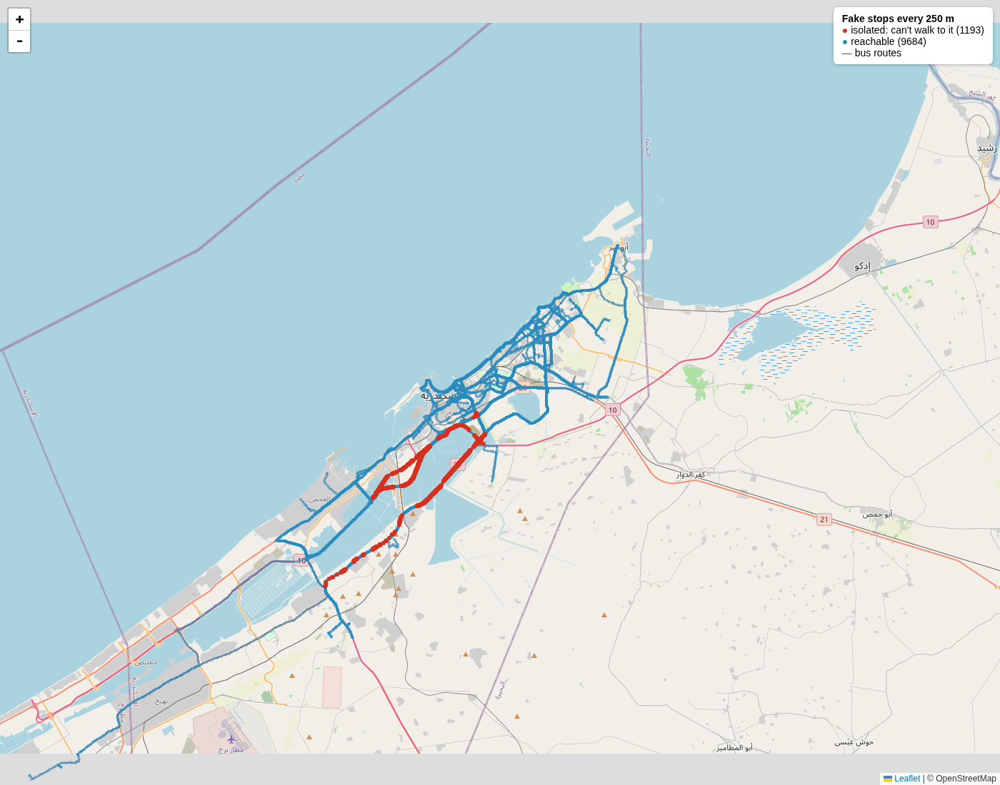

# Alexandria Public Transport

Trip planning for Alexandria, Egypt, built on [OpenTripPlanner](https://www.opentripplanner.org/) (OTP).

## The problem

Alexandria's buses and microbuses are **hail-and-ride**: riders wave a vehicle down and get off almost anywhere along its route. The survey data has only 441 stops for 104 routes, and OTP only lets riders board at stops. So a stop-only router tells people to walk a kilometre to a stop that the microbus passes right next to them.

GTFS can express "board anywhere along this stretch" (`continuous_pickup` / `continuous_drop_off`), but OTP 2 reads those fields and ignores them.

## How this project handles it

- **Synthetic stops.** Extra stops along each route's shape, with times interpolated by distance (`tools/gtfs/`, `tools/benchmark/variants.py`). The feed OTP serves today has one every ~200 m.
- **But not on every road.** Vehicles don't stop on highways, flyovers, tunnels or ramps, so synthetic stops on roads that forbid walking in OpenStreetMap must go (`tools/gtfs/no_stop_roads.py`). At 250 m spacing that is 3,167 of 10,436. The served feed has not been regenerated with this rule yet.

  

- **Fast searches.** By default, OTP repeats its search for every departure minute over a window of up to 3 hours. For frequency-based trips like these, that is wasted work. In a benchmark of 800 trips, a fixed 10-minute window kept 99.6% of searches under 1 s (`tools/benchmark/`).

A work-in-progress OTP fork that supports hail-and-ride natively lives at [AI091/OpenTripPlanner-hail-and-ride](https://github.com/AI091/OpenTripPlanner-hail-and-ride).

## Repository layout

| Path | What it is |
|------|------------|
| `apps/site` | Static route pages (Astro) |
| `apps/server-go` | API prototype that proxies OTP |
| `infra/otp` | OTP configuration and the GTFS feed OTP serves |
| `tools/gtfs` | Synthetic-stop generation and the no-stop-roads rule |
| `tools/benchmark` | 800-trip benchmark harness |
| `tools/bruno` | API requests for [Bruno](https://www.usebruno.com/) |
| `data/alexandria` | The original DT4A dataset (see License) |
| `knowledge` | Learning notes and the dataset change log |

## Getting started

Needs [Docker](https://docs.docker.com/get-docker/) with the Compose plugin.

```bash
# 1. Download Egypt OSM data (~168MB)
wget -O infra/otp/egypt-latest.osm.pbf https://download.geofabrik.de/africa/egypt-latest.osm.pbf

# 2. Build the graph (~2min, writes infra/otp/graph.obj)
docker compose run --rm otp --build --save

# 3. Start OTP
docker compose up -d
```

OTP is now running at **http://localhost:8080**. Query it with GraphQL at `http://localhost:8080/otp/gtfs/v1`:

```bash
curl -X POST http://localhost:8080/otp/gtfs/v1 \
  -H "Content-Type: application/json" \
  -d '{"query":"{ plan(from:{lat:31.2156,lon:29.9553}, to:{lat:31.2001,lon:29.9187}, date:\"2026-10-05\", time:\"08:00:00\", transportModes:[{mode:BUS},{mode:WALK}]) { itineraries { duration legs { mode startTime endTime from { name } to { name } route { shortName longName } } } } }"}'
```

Any date works: the calendar was extended to 2099. There is also an interactive query builder at `http://localhost:8080/graphiql`.

To stop OTP, or to rebuild after changing the GTFS, OSM or config:

```bash
docker compose down                         # stop
docker compose run --rm otp --build --save  # rebuild the graph
docker compose up -d --force-recreate otp   # restart OTP on the new graph
```

## License

- **Code:** MIT, see [LICENSE](LICENSE).
- **Transit data:** the Alexandria GTFS dataset (`data/alexandria/`, `infra/otp/alex_gtfs.zip` and the synthetic stop CSVs) is a product of [DigitalTransport4Africa](https://digitaltransport4africa.org/) and [Transport for Cairo](https://transportforcairo.com/), funded by the [French Development Agency (AfD)](https://www.afd.fr/en). It was collected by 80 students of the [Arab Academy for Science, Technology & Maritime Transport](https://aast.edu/en/) in 2022, and is licensed under [CC BY-NC 4.0](https://creativecommons.org/licenses/by-nc/4.0/). **This repository modifies it:** the calendar is extended to 2099, and synthetic hail-and-ride stops with interpolated times are added. Every change is logged in [knowledge/dataset.md](knowledge/dataset.md). Commercial use needs permission from DT4A.
- **Map data:** © [OpenStreetMap](https://www.openstreetmap.org/copyright) contributors, ODbL.
